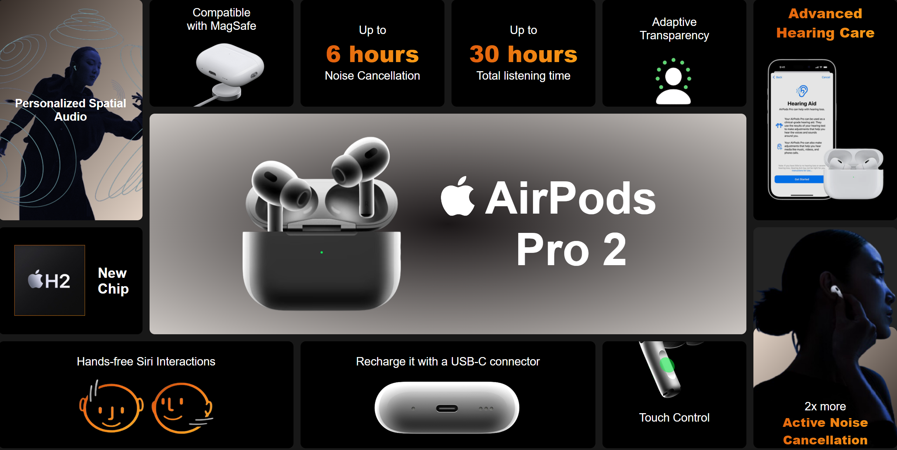

# 🎧 Apple Slide — Grid Practice

A practice project to master CSS Grid inspired by Apple's visual compositions.

## 📋 Description

I wanted to practice **CSS Grid** in a more realistic environment, so I looked for reference examples and noticed that Apple frequently uses this type of visual compositions in their products. I chose the **AirPods Pro 2** as inspiration to create an Apple-style slide.

### 🎨 Development Process
1. **Figma Design**: Created the complete design (structure, layout, and styles) to plan how elements would be organized within the grid
2. **Implementation**: Translated the design to code using HTML and CSS, replicating the idea of an Apple slide but built completely from scratch
3. **Optimization**: Focus on advanced Grid and Flexbox techniques

> **Note**: Current version is optimized for **desktop** only (responsive pending)

---

## 📸 Preview



*Visual composition inspired by Apple, created completely from scratch*

---

## 🛠️ Technologies Used

 


- **HTML5** – Semantic structure  
- **CSS3** – Styles and layout  
  - CSS Grid (main focus)  
  - Flexbox (internal elements)  
  - Gradients (visual effects)  
  - Custom Properties (CSS variables) 

---

## 🚀 Installation and Usage

### Prerequisites
- Modern web browser (Chrome, Firefox, Safari, Edge)
- Code editor (optional, for modifications)

### Steps to Run

1. **Clone the repository**
   ```bash
   git clone https://github.com/your-username/apple-slide-replica.git
   cd apple-slide-replica
   ```

2. **Open in browser**
   - Option 1: Double click on `index.html`
   - Option 2: With Live Server (VS Code)
     ```bash
     # Install Live Server if you don't have it
     # Then right-click → "Open with Live Server"
     ```

---

## ✨ Key Features

- **Advanced Grid Layout**: Sophisticated element organization
- **Custom Gradients**: Apple-like visual effects
- **Careful Typography**: Clear visual hierarchy
- **Image Optimization**: Efficient asset loading
- **Semantic Code**: Structured and accessible HTML
---

## 📱 Roadmap

### Upcoming Improvements
- **Responsive Design**
  - [ ] Tablet breakpoints (768px)
  - [ ] Mobile breakpoints (480px)
  - [ ] Adaptive grid for different screens
- **Optimizations**
  - [ ] Image lazy loading
  - [ ] CSS minification
  - [ ] Performance optimization
- **Additional Features**
  - [ ] Smooth animations (CSS transitions)
  - [ ] Dark/light mode
  - [ ] Enhanced hover interactions

---

## 🎯 Learning Goals Achieved

- ✅ CSS Grid Layout mastery
- ✅ Effective Grid + Flexbox combination
- ✅ Professional interface-inspired visual design
- ✅ Figma → Code design translation
---

## 📚 Reference Resources

- [CSS Grid Guide - MDN](https://developer.mozilla.org/en-US/docs/Web/CSS/CSS_Grid_Layout)
- [Grid-based Apple presentations](https://developer.apple.com/design/)

---

## ⚖️ License

This project is licensed under the **Apache 2.0** License. See the [LICENSE](LICENSE) file for details.

---

> 💡 **Disclaimer**: This project was created solely for practice and learning purposes. The design is inspired by Apple but was developed completely from scratch. It has no official affiliation with Apple Inc.
